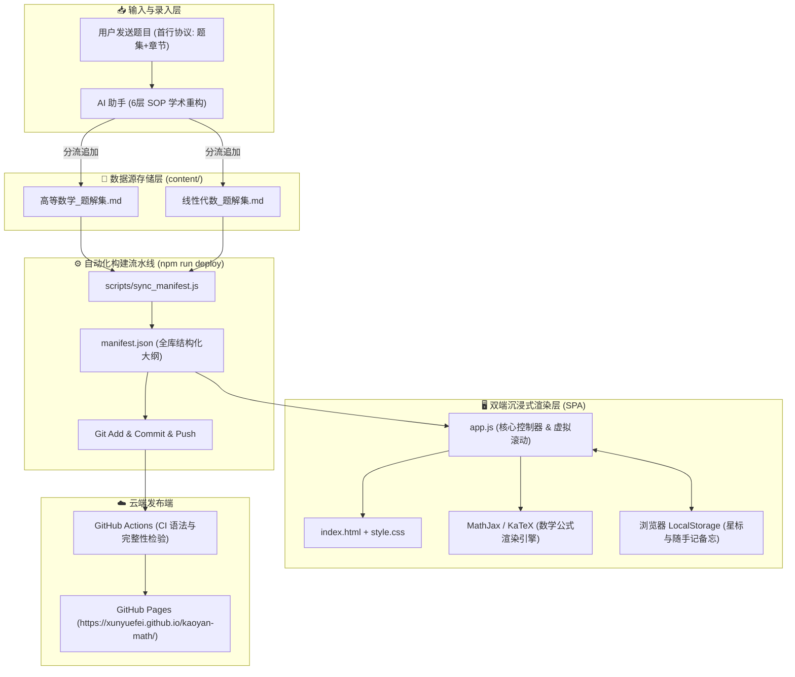

# 📐 考研数学知识库 · 深度系统架构设计规范 (ARCHITECTURE.md)

本文档阐述考研数学知识库（Kaoyan Math SOP Solutions）的系统架构、数据流向、模块拓扑与交互机制。

---

## 🏗️ 顶层架构全景图

系统由 **数据源存储层**、**自动化同步流水线**、**轻量索引层** 以及 **双端交互渲染层** 构成：

---

## 🧩 核心模块与职责划分

### 1. 数据持久层 (`content/*.md`)
* **唯一真实数据源 (Single Source of Truth)**：
  * `content/高等数学_题解集.md`
  * `content/线性代数_题解集.md`
* 采用结构化 Markdown 注释与标准 HTML 锚点 `` 标记每道题目；
* 完全与任何特定渲染引擎解耦，保证数据在 Typora、Obsidian 或 GitHub 原生环境下均具备极高的可读性。

### 2. 索引同步引擎 (`scripts/sync_manifest.js`)
* 采用 AST 正则深度扫描两个 Markdown 数据源；
* 提取出每道题目的元数据：
  * `id`: 题目唯一标识符 (例如 `problem-524`)
  * `number`: 题号
  * `title`: 题目简明标题
  * `chapter`: 归属章节（严格落入 6 大标准章节）
  * `source`: 来源题集（如严选题、600题）
  * `tags`: 题型标签
  * `file`: 所在 Markdown 数据源相对路径
* 汇总输出为极轻量的 `manifest.json`。

### 3. 单页客户端应用 (`index.html`, `app.js`, `style.css`)
* **渐进式渲染**：页面初始化仅加载 `manifest.json`，呈现侧边栏大纲与搜索面板；
* **按需拉取**：点击某章节或题目时，按需拉取并缓存对应 Markdown 分卷；
* **星标与备忘系统**：
  * 状态定义：`⭐ 核心重点`、`🔴 待重刷/常错`、`🟢 已完全掌握`；
  * 随手记备忘：支持对任意题号添加个人心得并提供侧边栏抽屉目录导览；
  * 数据隔离：完全保存于客户端 `localStorage`，兼顾隐私与离线体验。

### 4. 移动端流体自适应设计
* 断点定义：`@media (max-width: 768px)`；
* 侧边栏抽屉化（滑动呼出、点击遮罩收起）；
* 矩阵公式与多重积分容器配置 `overflow-x: auto`，杜绝页面横向撑破。
