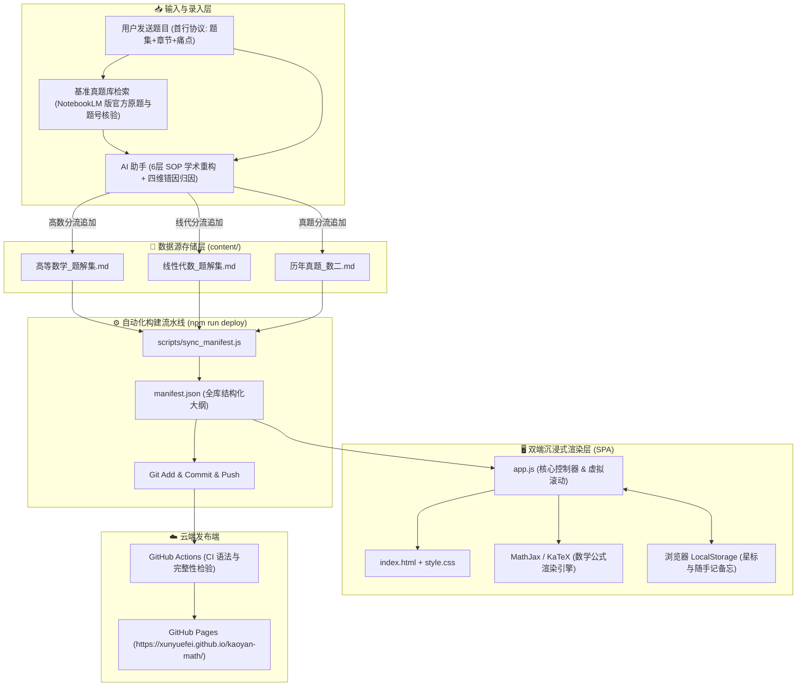

# 📐 考研数学知识库 · 深度系统架构设计规范 (ARCHITECTURE.md)

本文档阐述考研数学知识库（Kaoyan Math SOP Solutions）的系统架构、数据流向、模块拓扑与交互机制。

---

## 🏗️ 顶层架构全景图

系统由 **数据源存储层**、**自动化同步流水线**、**轻量索引层** 以及 **双端交互渲染层** 构成：

```mermaid
flowchart TD
    subgraph Input["📥 输入与录入层"]
        UserPrompt["用户发送题目 (首行协议: 题集+章节+痛点)"]
        GroundTruth["基准真题库检索 (NotebookLM 版官方原题与题号核验)"]
        AIAgent["AI 助手 (6层 SOP 学术重构 + 四维错因归因)"]
    end

    subgraph DataStorage["💾 数据源存储层 (content/)"]
        GaoshuMD["高等数学_题解集.md"]
        XiandaiMD["线性代数_题解集.md"]
        ZhentiMD["历年真题_数二.md"]
    end

    subgraph Pipeline["⚙️ 自动化构建流水线 (npm run deploy)"]
        SyncScript["scripts/sync_manifest.js"]
        ManifestJSON["manifest.json (全库结构化大纲)"]
        GitCommit["Git Add & Commit & Push"]
    end

    subgraph Frontend["🖥️ 双端沉浸式渲染层 (SPA)"]
        IndexHTML["index.html + style.css"]
        AppJS["app.js (核心控制器 & 虚拟滚动)"]
        MathEngine["MathJax / KaTeX (数学公式渲染引擎)"]
        Storage["浏览器 LocalStorage (星标与随手记备忘)"]
    end

    subgraph Deploy["☁️ 云端发布端"]
        GHAction["GitHub Actions (CI 语法与完整性检验)"]
        GHPages["GitHub Pages (https://xunyuefei.github.io/kaoyan-math/)"]
    end

    UserPrompt --> GroundTruth
    GroundTruth --> AIAgent
    UserPrompt --> AIAgent
    AIAgent -->|高数分流追加| GaoshuMD
    AIAgent -->|线代分流追加| XiandaiMD
    AIAgent -->|真题分流追加| ZhentiMD
    GaoshuMD --> SyncScript
    XiandaiMD --> SyncScript
    ZhentiMD --> SyncScript
    SyncScript --> ManifestJSON
    ManifestJSON --> GitCommit
    GitCommit --> GHAction --> GHPages
    ManifestJSON --> AppJS
    AppJS --> IndexHTML
    AppJS --> MathEngine
    AppJS <--> Storage
```

---

## 🧩 核心模块与职责划分

### 1. 数据持久层 (`content/*.md`)
* **三大唯一真实数据源 (Single Sources of Truth)**：
  * `content/高等数学_题解集.md`（高数专题强化：讲义、660题、严选题）
  * `content/线性代数_题解集.md`（线代专题强化：讲义、660题、严选题）
  * `content/历年真题_数二.md`（2005–2026 历年真题：按年份与官方原题号，挂载四维错因）
* 采用结构化 Markdown 注释与标准 HTML 锚点 `` 或 `` 标记每道题目；
* 完全与任何特定渲染引擎解耦，保证数据在 Typora、Obsidian 或 GitHub 原生环境下均具备极高的可读性。

### 2. 索引同步引擎 (`scripts/sync_manifest.js`)
* 采用 AST 正则深度扫描三个 Markdown 数据源；
* 提取出每道题目的元数据：
  * `id`: 题目唯一标识符 (例如 `problem-524` 或 `problem-2021-15`)
  * `number`: 题号 (例如 `524` 或 `2021-T15`)
  * `title`: 题目简明标题
  * `chapter`: 归属章节（严格落入 12 大标准考纲章节）
  * `source`: 来源题集（如严选题、660题、2021年数二）
  * `tags`: 题型标签（真题第一标签为四维带色错因痛点）
  * `file`: 所在 Markdown 数据源相对路径
* 汇总输出为极轻量的 `manifest.json`。

### 3. 单页客户端应用 (`index.html`, `app.js`, `style.css`)
* **渐进式渲染**：页面初始化仅加载 `manifest.json`，呈现侧边栏大纲与搜索面板；
* **按需拉取**：点击某章节或题目时，按需拉取并缓存对应 Markdown 分卷；
* **星标与备忘系统**：
  * 状态定义：`⭐ 核心重点`、`🔴 待重刷/常错`、`🟢 已完全掌握`；
  * 随手记备忘：支持对任意题号添加个人心得并提供侧边栏抽屉目录导览；
  * 数据隔离：完全保存于客户端 `localStorage`，兼顾隐私与离线体验。

### 4. 移动端流体自适应设计
* 断点定义：`@media (max-width: 768px)`；
* 侧边栏抽屉化（滑动呼出、点击遮罩收起）；
* 矩阵公式与多重积分容器配置 `overflow-x: auto`，杜绝页面横向撑破。
